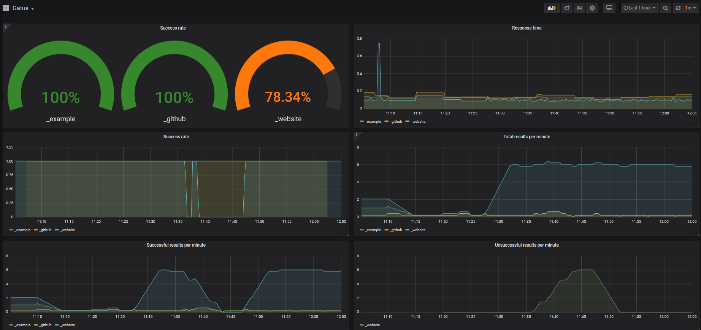

## Usage
Gatus exposes Prometheus metrics at `/metrics` if the `metrics` configuration option is set to `true`.

To run this example, all you need to do is execute the following command:
```console
docker-compose up
```
Once you've done the above, you should be able to access the Grafana dashboard at `http://localhost:3000`.




## Queries
By default, this example has a Grafana dashboard with some panels, but for the sake of verbosity, you'll find
a list of simple queries below. Those make use of the `key` parameter, which is a concatenation of the endpoint's
group and name.

### Success rate
```
sum(rate(gatus_results_total{success="true"}[30s])) by (key) / sum(rate(gatus_results_total[30s])) by (key)
```

### Response time
```
gatus_results_duration_seconds
```

### Total results per minute
```
sum(rate(gatus_results_total[5m])*60) by (key)
```

### Total successful results per minute
```
sum(rate(gatus_results_total{success="true"}[5m])*60) by (key)
```

### Total unsuccessful results per minute
```
sum(rate(gatus_results_total{success="false"}[5m])*60) by (key)
```
