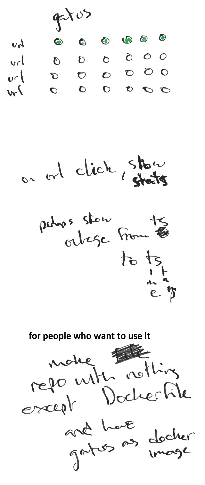

# gatus (in progress)

A service health dashboard in Go


## Draft




## Usage

```yaml
services:
  - name: twinnation  # Name of your service, can be anything
    url: https://twinnation.org/actuator/health
    interval: 15s # Duration to wait between every status check (opt. default: 10s) 
    failure-threshold: 3 
    conditions:
      - "$STATUS == 200"
  - name: github
    url: https://api.github.com/healthz
    conditions:
      - "$STATUS == 200"
```


## Running the tests

```
go test ./... -mod vendor
```
