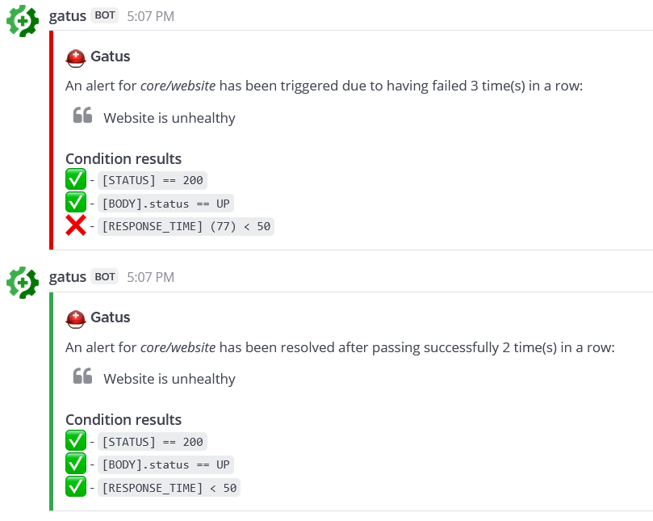

[](https://goreportcard.com/report/github.com/TwinProduction/gatus)
[](https://codecov.io/gh/TwinProduction/gatus)
[](https://github.com/TwinProduction/gatus)
[](https://cloud.docker.com/repository/docker/twinproduction/gatus)
[](https://github.com/TwinProduction)

A service health dashboard in Go that is meant to be used as a docker 
image with a custom configuration file.

I personally deploy it in my Kubernetes cluster and let it monitor the status of my
core applications: https://status.twinnation.org/


## Table of Contents

- [Features](#features)
- [Usage](#usage)
  - [Configuration](#configuration)
  - [Conditions](#conditions)
    - [Placeholders](#placeholders)
    - [Functions](#functions)
  - [Alerting](#alerting)
    - [Configuring Slack alerts](#configuring-slack-alerts)
    - [Configuring PagerDuty alerts](#configuring-pagerduty-alerts)
    - [Configuring Twilio alerts](#configuring-twilio-alerts)
    - [Configuring Mattermost alerts](#configuring-mattermost-alerts)
    - [Configuring Messagebird alerts](#configuring-messagebird-alerts)    
    - [Configuring custom alerts](#configuring-custom-alerts)
  - [Kubernetes (ALPHA)](#kubernetes-alpha)
    - [Auto Discovery](#auto-discovery)
    - [Deploying](#deploying)
- [Docker](#docker)
- [Running the tests](#running-the-tests)
- [Using in Production](#using-in-production)
- [FAQ](#faq)
  - [Sending a GraphQL request](#sending-a-graphql-request)
  - [Recommended interval](#recommended-interval)
  - [Default timeouts](#default-timeouts)
  - [Monitoring a TCP service](#monitoring-a-tcp-service)
  - [Monitoring a service using ICMP](#monitoring-a-service-using-icmp)
  - [Monitoring a service using DNS queries](#monitoring-a-service-using-dns-queries)
  - [Basic authentication](#basic-authentication)
  - [disable-monitoring-lock](#disable-monitoring-lock)
  - [Service groups](#service-groups)
  - [Exposing Gatus on a custom port](#exposing-gatus-on-a-custom-port)
  - [Uptime Badges (ALPHA)](#uptime-badges)


## Features

The main features of Gatus are:
- **Highly flexible health check conditions**: While checking the response status may be enough for some use cases, Gatus goes much further and allows you to add conditions on the response time, the response body and even the IP address.
- **Ability to use Gatus for user acceptance tests**: Thanks to the point above, you can leverage this application to create automated user acceptance tests.
- **Very easy to configure**: Not only is the configuration designed to be as readable as possible, it's also extremely easy to add a new service or a new endpoint to monitor.
- **Alerting**: While having a pretty visual dashboard is useful to keep track of the state of your application(s), you probably don't want to stare at it all day. Thus, notifications via Slack, Mattermost, Messagebird, PagerDuty and Twilio are supported out of the box with the ability to configure a custom alerting provider for any needs you might have, whether it be a different provider or a custom application that manages automated rollbacks. 
- **Metrics**
- **Low resource consumption**: As with most Go applications, the resource footprint that this application requires is negligibly small.
- **GitHub uptime badges**:   
- **Service auto discovery in Kubernetes** (ALPHA)


## Usage

By default, the configuration file is expected to be at `config/config.yaml`.

You can specify a custom path by setting the `GATUS_CONFIG_FILE` environment variable.

Here's a simple example:

```yaml
metrics: true         # Whether to expose metrics at /metrics
services:
  - name: twinnation  # Name of your service, can be anything
    url: "https://twinnation.org/health"
    interval: 30s     # Duration to wait between every status check (default: 60s)
    conditions:
      - "[STATUS] == 200"         # Status must be 200
      - "[BODY].status == UP"     # The json path "$.status" must be equal to UP
      - "[RESPONSE_TIME] < 300"   # Response time must be under 300ms
  - name: example
    url: "https://example.org/"
    interval: 30s
    conditions:
      - "[STATUS] == 200"
```

This example would look like this:


Note that you can also add environment variables in the configuration file (i.e. `$DOMAIN`, `${DOMAIN}`)


### Configuration

| Parameter                                | Description                                                                   | Default        |
|:---------------------------------------- |:----------------------------------------------------------------------------- |:-------------- |
| `debug`                                  | Whether to enable debug logs                                                  | `false`        |
| `metrics`                                | Whether to expose metrics at /metrics                                         | `false`        |
| `storage`                                | Storage configuration                                                         | `{}`           |
| `storage.file`                           | File to persist the data in. If not set, storage is in-memory only.           | `""`           |
| `services`                               | List of services to monitor                                                   | Required `[]`  |
| `services[].name`                        | Name of the service. Can be anything.                                         | Required `""`  |
| `services[].group`                       | Group name. Used to group multiple services together on the dashboard. See [Service groups](#service-groups). | `""`           |
| `services[].url`                         | URL to send the request to                                                    | Required `""`  |
| `services[].method`                      | Request method                                                                | `GET`          |
| `services[].insecure`                    | Whether to skip verifying the server's certificate chain and host name        | `false`        |
| `services[].conditions`                  | Conditions used to determine the health of the service                        | `[]`           |
| `services[].interval`                    | Duration to wait between every status check                                   | `60s`          |
| `services[].graphql`                     | Whether to wrap the body in a query param (`{"query":"$body"}`)               | `false`        |
| `services[].body`                        | Request body                                                                  | `""`           |
| `services[].headers`                     | Request headers                                                               | `{}`           |
| `services[].dns`                         | Configuration for a service of type DNS. See [Monitoring using DNS queries](#monitoring-using-dns-queries)  | `""`           |
| `services[].dns.query-type`              | Query type for DNS service                                                    | `""`           |
| `services[].dns.query-name`              | Query name for DNS service                                                    | `""`           |
| `services[].alerts[].type`               | Type of alert. Valid types: `slack`, `pagerduty`, `twilio`, `mattermost`, `messagebird`, `custom` | Required `""`  |
| `services[].alerts[].enabled`            | Whether to enable the alert                                                   | `false`        |
| `services[].alerts[].failure-threshold`  | Number of failures in a row needed before triggering the alert                | `3`            |
| `services[].alerts[].success-threshold`  | Number of successes in a row before an ongoing incident is marked as resolved | `2`            |
| `services[].alerts[].send-on-resolved`   | Whether to send a notification once a triggered alert is marked as resolved   | `false`        |
| `services[].alerts[].description`        | Description of the alert. Will be included in the alert sent                  | `""`           |
| `alerting`                               | Configuration for alerting                                                    | `{}`           |
| `alerting.slack`                         | Configuration for alerts of type `slack`                                      | `{}`           |
| `alerting.slack.webhook-url`             | Slack Webhook URL                                                             | Required `""`  |
| `alerting.pagerduty`                     | Configuration for alerts of type `pagerduty`                                  | `{}`           |
| `alerting.pagerduty.integration-key`     | PagerDuty Events API v2 integration key.                                      | Required `""`  |
| `alerting.twilio`                        | Settings for alerts of type `twilio`                                          | `{}`           |
| `alerting.twilio.sid`                    | Twilio account SID                                                            | Required `""`  |
| `alerting.twilio.token`                  | Twilio auth token                                                             | Required `""`  |
| `alerting.twilio.from`                   | Number to send Twilio alerts from                                             | Required `""`  |
| `alerting.twilio.to`                     | Number to send twilio alerts to                                               | Required `""`  |
| `alerting.mattermost`                    | Configuration for alerts of type `mattermost`                                 | `{}`           |
| `alerting.mattermost.webhook-url`        | Mattermost Webhook URL                                                        | Required `""`  |
| `alerting.mattermost.insecure`           | Whether to skip verifying the server's certificate chain and host name        | `false`        |
| `alerting.messagebird`                   | Settings for alerts of type `messagebird`                                     | `{}`           |
| `alerting.messagebird.access-key`        | Messagebird access key                                                        | Required `""`  |
| `alerting.messagebird.originator`        | The sender of the message                                                     | Required `""`  |
| `alerting.messagebird.recipients`        | The recipients of the message                                                 | Required `""`  |
| `alerting.custom`                        | Configuration for custom actions on failure or alerts                         | `{}`           |
| `alerting.custom.url`                    | Custom alerting request url                                                   | Required `""`  |
| `alerting.custom.method`                 | Request method                                                                | `GET`          |
| `alerting.custom.insecure`               | Whether to skip verifying the server's certificate chain and host name        | `false`        |
| `alerting.custom.body`                   | Custom alerting request body.                                                 | `""`           |
| `alerting.custom.headers`                | Custom alerting request headers                                               | `{}`           |
| `security`                               | Security configuration                                                        | `{}`           |
| `security.basic`                         | Basic authentication security configuration                                   | `{}`           |
| `security.basic.username`                | Username for Basic authentication                                             | Required `""`  |
| `security.basic.password-sha512`         | Password's SHA512 hash for Basic authentication                               | Required `""`  |
| `disable-monitoring-lock`                | Whether to [disable the monitoring lock](#disable-monitoring-lock)            | `false`        |
| `web`                                    | Web configuration                                                             | `{}`           |
| `web.address`                            | Address to listen on                                                          | `0.0.0.0`      |
| `web.port`                               | Port to listen on                                                             | `8080`         |

For Kubernetes configuration, see [Kubernetes](#kubernetes-alpha)


### Conditions

Here are some examples of conditions you can use:

| Condition                    | Description                                             | Passing values             | Failing values |
|:-----------------------------|:------------------------------------------------------- |:-------------------------- | -------------- |
| `[STATUS] == 200`            | Status must be equal to 200                             | 200                        | 201, 404, ...  |
| `[STATUS] < 300`             | Status must lower than 300                              | 200, 201, 299              | 301, 302, ...  |
| `[STATUS] <= 299`            | Status must be less than or equal to 299                | 200, 201, 299              | 301, 302, ...  |
| `[STATUS] > 400`             | Status must be greater than 400                         | 401, 402, 403, 404         | 400, 200, ...  |
| `[STATUS] == any(200, 429)`  | Status must be either 200 or 420                        | 200, 429                   | 201, 400, ...  |
| `[CONNECTED] == true`        | Connection to host must've been successful              | true, false                |  |
| `[RESPONSE_TIME] < 500`      | Response time must be below 500ms                       | 100ms, 200ms, 300ms        | 500ms, 501ms   |
| `[IP] == 127.0.0.1`          | Target IP must be 127.0.0.1                             | 127.0.0.1                  | 0.0.0.0        |
| `[BODY] == 1`                | The body must be equal to 1                             | 1                          | `{}`, `2`, ... |
| `[BODY].user.name == john`   | JSONPath value of `$.user.name` is equal to `john`      | `{"user":{"name":"john"}}` |  |
| `[BODY].data[0].id == 1`     | JSONPath value of `$.data[0].id` is equal to 1          | `{"data":[{"id":1}]}`      |  |
| `[BODY].age == [BODY].id`    | JSONPath value of `$.age` is equal JSONPath `$.id`      | `{"age":1,"id":1}`         |  |
| `len([BODY].data) < 5`       | Array at JSONPath `$.data` has less than 5 elements     | `{"data":[{"id":1}]}`      |  |
| `len([BODY].name) == 8`      | String at JSONPath `$.name` has a length of 8           | `{"name":"john.doe"}`      | `{"name":"bob"}` |
| `[BODY].name == pat(john*)`  | String at JSONPath `$.name` matches pattern `john*`     | `{"name":"john.doe"}`      | `{"name":"bob"}` |
| `[BODY].id == any(1, 2)`     | Value at JSONPath `$.id` is equal to `1` or `2`         | 1, 2                       | 3, 4, 5 |
| `[CERTIFICATE_EXPIRATION] > 48h` | Certificate expiration is more than 48h away        | 49h, 50h, 123h             | 1h, 24h, ... |


#### Placeholders

| Placeholder                | Description                                                     | Example of resolved value |
|:-------------------------- |:--------------------------------------------------------------- |:------------------------- |
| `[STATUS]`                 | Resolves into the HTTP status of the request                    | 404
| `[RESPONSE_TIME]`          | Resolves into the response time the request took, in ms         | 10
| `[IP]`                     | Resolves into the IP of the target host                         | 192.168.0.232
| `[BODY]`                   | Resolves into the response body. Supports JSONPath.             | `{"name":"john.doe"}`
| `[CONNECTED]`              | Resolves into whether a connection could be established         | `true`
| `[CERTIFICATE_EXPIRATION]` | Resolves into the duration before certificate expiration        | `24h`, `48h`, 0 (if not using HTTPS)
| `[DNS_RCODE]`              | Resolves into the DNS status of the response                    | NOERROR


#### Functions

| Function   | Description                                                                                                      | Example                    |
|:-----------|:---------------------------------------------------------------------------------------------------------------- |:-------------------------- |
| `len`      | Returns the length of the object/slice. Works only with the `[BODY]` placeholder.                                | `len([BODY].username) > 8`
| `pat`      | Specifies that the string passed as parameter should be evaluated as a pattern. Works only with `==` and `!=`.   | `[IP] == pat(192.168.*)`
| `any`      | Specifies that any one of the values passed as parameters is a valid value. Works only with `==` and `!=`.       | `[BODY].ip == any(127.0.0.1, ::1)`

**NOTE**: Use `pat` only when you need to. `[STATUS] == pat(2*)` is a lot more expensive than `[STATUS] < 300`.


### Alerting


#### Configuring Slack alerts

```yaml
alerting:
  slack: 
    webhook-url: "https://hooks.slack.com/services/**********/**********/**********"
services:
  - name: twinnation
    url: "https://twinnation.org/health"
    interval: 30s
    alerts:
      - type: slack
        enabled: true
        description: "healthcheck failed 3 times in a row"
        send-on-resolved: true
      - type: slack
        enabled: true
        failure-threshold: 5
        description: "healthcheck failed 5 times in a row"
        send-on-resolved: true
    conditions:
      - "[STATUS] == 200"
      - "[BODY].status == UP"
      - "[RESPONSE_TIME] < 300"
```

Here's an example of what the notifications look like:


#### Configuring PagerDuty alerts

It is highly recommended to set `services[].alerts[].send-on-resolved` to `true` for alerts 
of type `pagerduty`, because unlike other alerts, the operation resulting from setting said 
parameter to `true` will not create another incident, but mark the incident as resolved on 
PagerDuty instead. 

```yaml
alerting:
  pagerduty: 
    integration-key: "********************************"
services:
  - name: twinnation
    url: "https://twinnation.org/health"
    interval: 30s
    alerts:
      - type: pagerduty
        enabled: true
        failure-threshold: 3
        success-threshold: 5
        send-on-resolved: true
        description: "healthcheck failed 3 times in a row"
    conditions:
      - "[STATUS] == 200"
      - "[BODY].status == UP"
      - "[RESPONSE_TIME] < 300"
```


#### Configuring Twilio alerts

```yaml
alerting:
  twilio:
    sid: "..."
    token: "..."
    from: "+1-234-567-8901"
    to: "+1-234-567-8901"
services:
  - name: twinnation
    interval: 30s
    url: "https://twinnation.org/health"
    alerts:
      - type: twilio
        enabled: true
        failure-threshold: 5
        send-on-resolved: true
        description: "healthcheck failed 5 times in a row"
    conditions:
      - "[STATUS] == 200"
      - "[BODY].status == UP"
      - "[RESPONSE_TIME] < 300"
```


#### Configuring Mattermost alerts

```yaml
alerting:
  mattermost: 
    webhook-url: "http://**********/hooks/**********"
    insecure: true
services:
  - name: twinnation
    url: "https://twinnation.org/health"
    interval: 30s
    alerts:
      - type: mattermost
        enabled: true
        description: "healthcheck failed 3 times in a row"
        send-on-resolved: true
    conditions:
      - "[STATUS] == 200"
      - "[BODY].status == UP"
      - "[RESPONSE_TIME] < 300"
```

Here's an example of what the notifications look like:




#### Configuring Messagebird alerts

Example of sending **SMS** text message alert using Messagebird:

```yaml
alerting:
  messagebird:
    access-key: "..."
    originator: "31619191918"
    recipients: "31619191919,31619191920"
services:
  - name: twinnation
    interval: 30s
    url: "https://twinnation.org/health"
    alerts:
      - type: messagebird
        enabled: true
        failure-threshold: 3
        send-on-resolved: true
        description: "healthcheck failed 3 times in a row"
    conditions:
      - "[STATUS] == 200"
      - "[BODY].status == UP"
      - "[RESPONSE_TIME] < 300"
```


#### Configuring custom alerts

While they're called alerts, you can use this feature to call anything. 

For instance, you could automate rollbacks by having an application that keeps tracks of new deployments, and by 
leveraging Gatus, you could have Gatus call that application endpoint when a service starts failing. Your application
would then check if the service that started failing was recently deployed, and if it was, then automatically 
roll it back.

The values `[ALERT_DESCRIPTION]` and `[SERVICE_NAME]` are automatically substituted for the alert description and the 
service name respectively in the body (`alerting.custom.body`) as well as the url (`alerting.custom.url`).

If you have `send-on-resolved` set to `true`, you may want to use `[ALERT_TRIGGERED_OR_RESOLVED]` to differentiate
the notifications. It will be replaced for either `TRIGGERED` or `RESOLVED`, based on the situation.

For all intents and purpose, we'll configure the custom alert with a Slack webhook, but you can call anything you want.

```yaml
alerting:
  custom:
    url: "https://hooks.slack.com/services/**********/**********/**********"
    method: "POST"
    insecure: true
    body: |
      {
        "text": "[ALERT_TRIGGERED_OR_RESOLVED]: [SERVICE_NAME] - [ALERT_DESCRIPTION]"
      }
services:
  - name: twinnation
    url: "https://twinnation.org/health"
    interval: 30s
    alerts:
      - type: custom
        enabled: true
        failure-threshold: 10
        success-threshold: 3
        send-on-resolved: true
        description: "healthcheck failed 10 times in a row"
    conditions:
      - "[STATUS] == 200"
      - "[BODY].status == UP"
      - "[RESPONSE_TIME] < 300"
```

### Kubernetes (ALPHA)

> **WARNING**: This feature is in ALPHA. This means that it is very likely to change in the near future, which means that
> while you can use this feature as you see fit, there may be breaking changes in future releases.

| Parameter                                   | Description                                                                   | Default        |
|:------------------------------------------- |:----------------------------------------------------------------------------- |:-------------- |
| `kubernetes`                                | Kubernetes configuration                                                      | `{}`           |
| `kubernetes.auto-discover`                  | Whether to enable auto discovery                                              | `false`        |
| `kubernetes.cluster-mode`                   | Cluster mode to use for authenticating. Supported values: `in`, `out`         | Required `""`  |
| `kubernetes.service-template`               | Service template. See `services[]` in [Configuration](#configuration)         | Required `nil` |
| `kubernetes.excluded-service-suffixes`      | List of service suffixes to not monitor (e.g. `canary`)                       | `[]`           |
| `kubernetes.namespaces`                     | List of configurations for the namespaces from which services will be discovered | `[]`        |
| `kubernetes.namespaces[].name`              | Namespace name                                                                | Required `""`  |
| `kubernetes.namespaces[].hostname-suffix`   | Suffix to append to the service name before calling `target-path`             | Required `""`  |
| `kubernetes.namespaces[].target-path`       | Path that will be called on the discovered service for the health check       | `""`           |
| `kubernetes.namespaces[].excluded-services` | List of services to not monitor in the given namespace                        | `[]`           |


#### Auto Discovery

Auto discovery works by reading all `Service` resources from the configured `namespaces` and appending the `hostname-suffix` as 
well as the configured `target-path` to the service name and making an HTTP call.

All auto-discovered services will have the service configuration populated from the `service-template`.

You can exclude certain services from the dashboard by using `kubernetes.excluded-service-suffixes` or `kubernetes.namespaces[].excluded-services`.

```yaml
kubernetes:
  auto-discover: true
  # out: Gatus is deployed outside of the K8s cluster.
  # in: Gatus is deployed in the K8s cluster
  cluster-mode: "out"                                              
  excluded-service-suffixes:
    - canary
  service-template:
    interval: 30s
    conditions:
      - "[STATUS] == 200"
  namespaces:
    - name: default
      # If cluster-mode is out, you should use an externally accessible hostname suffix (e.g.. .example.com)
      # This will result in gatus generating services with URLs like <service-name>.example.com
      # If cluster-mode is in, you can use either an externally accessible hostname suffix (e.g.. .example.com)
      # or an internally accessible hostname suffix (e.g. .default.svc.cluster.local)
      hostname-suffix: ".default.svc.cluster.local"
      target-path: "/health"
      # If some services cannot be or do not need to be monitored, you can exclude them by explicitly defining them
      # in the following list.
      excluded-services:
        - gatus
        - kubernetes
```

Note that `hostname-suffix` could also be something like `.yourdomain.com`, in which case the endpoint that would be 
monitored would be `potato.example.com/health`, assuming you have a service named `potato` and a matching ingress
to map `potato.example.com` to the `potato` service.

#### Deploying

See [example/kubernetes-with-auto-discovery](example/kubernetes-with-auto-discovery)


## Docker

Other than using one of the examples provided in the `examples` folder, you can also try it out locally by 
creating a configuration file - we'll call it `config.yaml` for this example - and running the following 
command:
```
docker run -p 8080:8080 --mount type=bind,source="$(pwd)"/config.yaml,target=/config/config.yaml --name gatus twinproduction/gatus
```

If you're on Windows, replace `"$(pwd)"` by the absolute path to your current directory, e.g.:
```
docker run -p 8080:8080 --mount type=bind,source=C:/Users/Chris/Desktop/config.yaml,target=/config/config.yaml --name gatus twinproduction/gatus
```


## Running the tests

```
go test ./... -mod vendor
```


## Using in Production

See the [example](example) folder.


## FAQ

### Sending a GraphQL request

By setting `services[].graphql` to true, the body will automatically be wrapped by the standard GraphQL `query` parameter.

For instance, the following configuration:
```yaml
services:
  - name: filter users by gender
    url: http://localhost:8080/playground
    method: POST
    graphql: true
    body: |
      {
        user(gender: "female") {
          id
          name
          gender
          avatar
        }
      }
    headers:
      Content-Type: application/json # XXX: as of v1.9.2, this header is automatically added when graphql is set to true
    conditions:
      - "[STATUS] == 200"
      - "[BODY].data.user[0].gender == female"
```

will send a `POST` request to `http://localhost:8080/playground` with the following body:
```json
{"query":"      {\n        user(gender: \"female\") {\n          id\n          name\n          gender\n          avatar\n        }\n      }"}
```


### Recommended interval

**NOTE**: This does not _really_ apply if `disable-monitoring-lock` is set to `true`, as the monitoring lock is what
tells Gatus to only evaluate one service at a time.

To ensure that Gatus provides reliable and accurate results (i.e. response time), Gatus only evaluates one service at a time
In other words, even if you have multiple services with the exact same interval, they will not execute at the same time.

You can test this yourself by running Gatus with several services configured with a very short, unrealistic interval, 
such as 1ms. You'll notice that the response time does not fluctuate - that is because while services are evaluated on
different goroutines, there's a global lock that prevents multiple services from running at the same time.

Unfortunately, there is a drawback. If you have a lot of services, including some that are very slow or prone to time out (the default
time out is 10s for HTTP and 5s for TCP), then it means that for the entire duration of the request, no other services can be evaluated.

**This does mean that Gatus will be unable to evaluate the health of other services**. 
The interval does not include the duration of the request itself, which means that if a service has an interval of 30s 
and the request takes 2s to complete, the timestamp between two evaluations will be 32s, not 30s. 

While this does not prevent Gatus' from performing health checks on all other services, it may cause Gatus to be unable 
to respect the configured interval, for instance:
- Service A has an interval of 5s, and times out after 10s to complete 
- Service B has an interval of 5s, and takes 1ms to complete
- Service B will be unable to run every 5s, because service A's health evaluation takes longer than its interval

To sum it up, while Gatus can really handle any interval you throw at it, you're better off having slow requests with 
higher interval.

As a rule of the thumb, I personally set interval for more complex health checks to `5m` (5 minutes) and 
simple health checks used for alerting (PagerDuty/Twilio) to `30s`.


### Default timeouts

| Protocol | Timeout |
|:-------- |:------- |
| HTTP     | 10s
| TCP      | 5s


### Monitoring a TCP service

By prefixing `services[].url` with `tcp:\\`, you can monitor TCP services at a very basic level:

```yaml
services:
  - name: redis
    url: "tcp://127.0.0.1:6379"
    interval: 30s
    conditions:
      - "[CONNECTED] == true"
```

Placeholders `[STATUS]` and `[BODY]` as well as the fields `services[].body`, `services[].insecure`, 
`services[].headers`, `services[].method` and `services[].graphql` are not supported for TCP services.

**NOTE**: `[CONNECTED] == true` does not guarantee that the service itself is healthy - it only guarantees that there's 
something at the given address listening to the given port, and that a connection to that address was successfully 
established.


### Monitoring a service using ICMP

By prefixing `services[].url` with `icmp:\\`, you can monitor services at a very basic level using ICMP, or more 
commonly known as "ping" or "echo":

```yaml
services:
  - name: ICMP
    url: "icmp://example.com"
    conditions:
      - "[CONNECTED] == true"
```

Only the placeholders `[CONNECTED]`, `[IP]` and `[RESPONSE_TIME]` are supported for services of type ICMP.
You can specify a domain prefixed by `icmp://`, or an IP address prefixed by `icmp://`.


### Monitoring a service using DNS queries

Defining a `dns` configuration in a service will automatically mark that service as a service of type DNS:
```yaml
services:
  - name: example dns query
    url: "8.8.8.8" # Address of the DNS server to use
    interval: 30s
    dns:
      query-name: "example.com"
      query-type: "A"
    conditions:
      - "[BODY] == 93.184.216.34"
      - "[DNS_RCODE] == NOERROR"
```

There are two placeholders that can be used in the conditions for services of type DNS:
- The placeholder `[BODY]` resolves to the output of the query. For instance, a query of type `A` would return an IPv4.
- The placeholder `[DNS_RCODE]` resolves to the name associated to the response code returned by the query, such as 
`NOERROR`, `FORMERR`, `SERVFAIL`, `NXDOMAIN`, etc.


### Basic authentication

You can require Basic authentication by leveraging the `security.basic` configuration:

```yaml
security:
  basic:
    username: "john.doe"
    password-sha512: "6b97ed68d14eb3f1aa959ce5d49c7dc612e1eb1dafd73b1e705847483fd6a6c809f2ceb4e8df6ff9984c6298ff0285cace6614bf8daa9f0070101b6c89899e22"
```

The example above will require that you authenticate with the username `john.doe` as well as the password `hunter2`.


### disable-monitoring-lock

Setting `disable-monitoring-lock` to `true` means that multiple services could be monitored at the same time.

While this behavior wouldn't generally be harmful, conditions using the `[RESPONSE_TIME]` placeholder could be impacted 
by the evaluation of multiple services at the same time, therefore, the default value for this parameter is `false`.

There are three main reasons why you might want to disable the monitoring lock:
- You're using Gatus for load testing (each services are periodically evaluated on a different goroutine, so 
technically, if you create 100 services with a 1 seconds interval, Gatus will send 100 requests per second)
- You have a _lot_ of services to monitor
- You want to test multiple services at very short interval (< 5s)


### Service groups

Service groups are used for grouping multiple services together on the dashboard.

```yaml
services:
  - name: frontend
    group: core
    url: "https://example.org/"
    interval: 5m
    conditions:
      - "[STATUS] == 200"

  - name: backend
    group: core
    url: "https://example.org/"
    interval: 5m
    conditions:
      - "[STATUS] == 200"

  - name: monitoring
    group: internal
    url: "https://example.org/"
    interval: 5m
    conditions:
      - "[STATUS] == 200"

  - name: nas
    group: internal
    url: "https://example.org/"
    interval: 5m
    conditions:
      - "[STATUS] == 200"

  - name: random service that isn't part of a group
    url: "https://example.org/"
    interval: 5m
    conditions:
      - "[STATUS] == 200"
```

The configuration above will result in a dashboard that looks like this:


### Exposing Gatus on a custom port

By default, Gatus is exposed on port `8080`, but you may specify a different port by setting the `web.port` parameter:
```yaml
web:
  port: 8081
```

If you're using a PaaS like Heroku that doesn't let you set a custom port and exposes it through an environment
variable instead, you can use that environment variable directly in the configuration file:
```yaml
web:
  port: ${PORT}
```

### Uptime badges


Gatus can automatically generate a SVG badge for one of your monitored services.
This allows you to put badges in your individual services' README or even create your own status page, if you 
desire.

The endpoint to generate a badge is the following:
```
/api/v1/badges/uptime/{duration}/{identifier}.svg
```
Where:
- `{duration}` is `7d`, `24h` or `1h`
- `{identifier}` has the pattern `<GROUP_NAME>_<SERVICE_NAME>.svg` in which both variables have ` `, `/`, `_`, `,` and `.` replaced by `-`.

For instance, if you want the uptime during the last 24 hours from the service `frontend` in the group `core`, 
the URL would look like this:
```
http://example.com/api/v1/badges/uptime/7d/core_frontend.svg
```

If you want to display a service that is not part of a group, you must leave the group value empty:
```
http://example.com/api/v1/badges/uptime/7d/_frontend.svg
```

Example: 
```

```

If you'd like to see a visual example of each badges available, you can simply navigate to the service's detail page.
